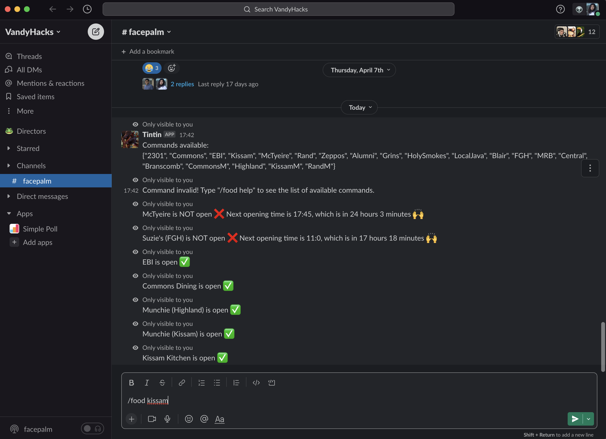

## tintin

This bot allows user to use shell or slash command to find out whether a specific Vanderbilt University dining hall is open right now.

This bot is created using Cloudflare Workers, Javascript, and the Luxon library by Austin Wang (Vanderbilt Class of 2023).

### Available Commands
- 2301
- Commons
- EBI
- Kissam
- McTyeire
- Rand
- Zeppos
- Alumni
- Grins
- HolySmokes
- LocalJava
- Blair
- FGH
- MRB
- Central
- Branscomb
- CommonsM
- Highland
- KissamM
- RandM

>*The 'M' denotes 'munchie mart*

>*Capitalization does not matter*

### Demo in Slack
#### Example usage as a Slack slash command
```
/food 2301
```
this will give you information on the dining location '2301'

#### See it in action!
